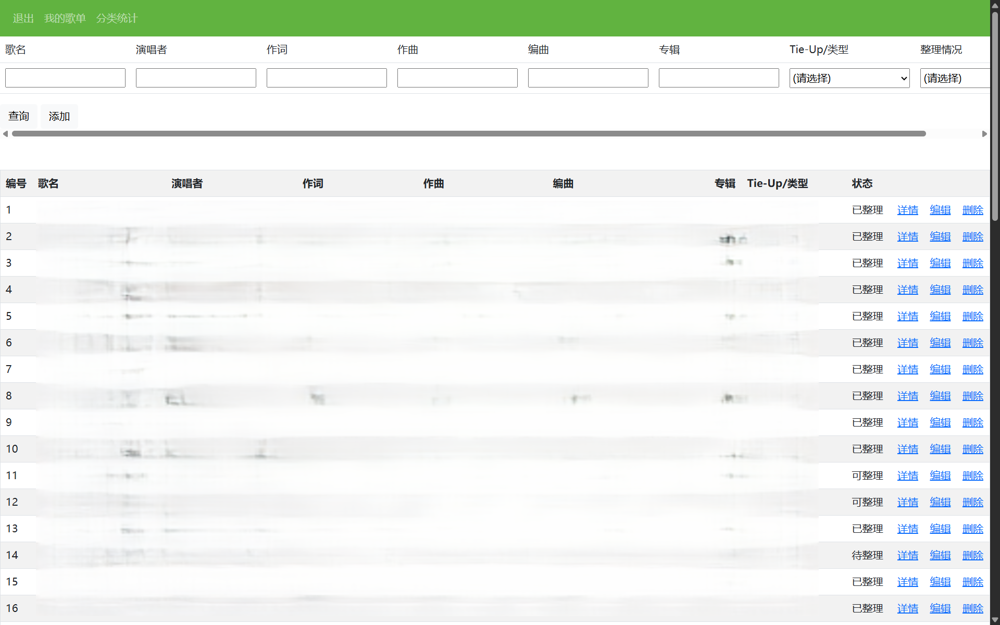

# SongListManagementTool

## Description
- This is a web application for creating and managing your own song list.
- This project was developed mainly using C# (ASP.NET), SQL, Bootstrap.
- This project was mainly created for the developer's personal use, so the functions may be somewhat limited, and some functions may not be useful for all users.
- Note that this project is only available in Chinese.

## Before Using
Don't forget to change the connection strings of database in the file `Web.config` before using, otherwise the program may not run as expected.

```xml
<connectionStrings>
    <add name="ConnectionString" connectionString="Data Source=(local); Initial Catalog=YOUR DATABASE NAME; User ID=YOUR USERNAME; Password=YOUR PASSWORD" />
</connectionStrings>
```

## Functions

### Sign up and Log in
You need to sign up an account in order to log in and use the functions below. Press '注册' and enter your username and password (twice) to sign up. Then press '登录' and enter your username and password to log in.

### My Page
My Page shows the user's song list stored in the database. Press '我的歌单' to see My Page. You can enter some song information into the textboxes at the top of the webpage to search ('查询') or add ('添加') new songs. You can check song information ('详情'), update ('编辑') or delete ('删除') song data at My Page.



### Song Information and Notes
By pressing '详情', you are directed to the song information page that shows the detailed information of a specific song stored in the database. You can update `tieup` and `status` information at song information page, add external links to the song, and check the note for the song.

By pressing '查看笔记' at a song information page, you can check and edit your note for that specific song. Press '保存' to save the note, so that it will be displayed the next time you open the note page.

### Statistics
The system also supports a function of grouping the song data according to the `tieup` and the `status` fields. This function is basically developed for personal use, because one of the the developer's interests is to listen to Japanese songs (mainly *anisongs* and VOCALOID songs) and write notes for them, and it is useful to know how many notes you have written and how many you are going to write.

Here `tieup` means the work a song is written for or has a connection with, such as an *anime* or a game. You can also simply treat it as a label for categorisation. And `status` means whether you have written a note for the song ('已整理'), or not but will do so later ('待整理'), or not but perhaps will do so ('可整理'), or not and won't do so ('不整理').

 For each `tieup` work, you can check the total number of songs and the number of songs in one of the four statuses. The progress ('进度') is calculated as the proportion of the songs with a note ('已整理' / ('已整理' + '待整理')).

 